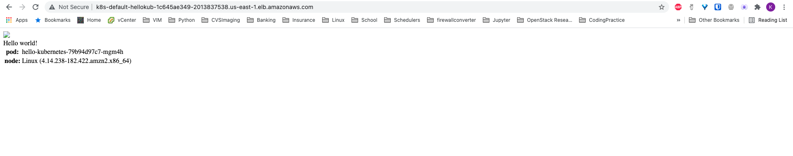

# Local Development

Local development is all done using docker compose. To quickly get a development environment up and running, execute:

```
docker compose up
```

To start but run services in the background, execute

```
docker compose up -d
```

# Deploying to Production

Once things have been developed locally and are working, they can easily be
deployed to AWS at production scale using a combination of Terraform,
Kubernetes, and Helm.

Terraform is the main driver for deploying all infrastructure, and in its
current form deploys everything to AWS. It deploys the following things:

  - A VPC, subnets, and IAM policies to support an EKS Kubernetes cluster. 
  - An EKS cluster
  - An [AWS Load Balancer Controller](https://artifacthub.io/packages/helm/aws/aws-load-balancer-controller) via Helm Charts and the Terraform Helm Provider

## Deploying the Cluster

To deploy a cluster of 2 nodes using t2.medium instances right off the bat, simply run the following from the root of the repo 

```bash
cd infra/tf
terraform init
terraform plan
terraform apply
```

You can provision multiple EKS clusters with a single `terraform apply`. First, edit the `infra/tf/main.tf` file and copy and paste the `module` section therein. Make sure to change the module name from `dev_cluster` and also change the `cluster_name` variable within the module block.

## Deploying Test Applications

To test that all actually worked, you can deploy some simple test K8s applications. The Kubernetes manifests for these applications are all found in `infra/k8s`. To try one out, first configure your `kubectl` command line client to speak to the cluster(s) you just deployed. After a successful Terraform deployment, there should be `kubectl` configuration files in `infra/tf/kubeconfig_eks-${cluster_name}`. Pick the cluster you want to interact with, then configure `kubectl` to use it within

```bash
export export KUBECONFIG=path/to/infra/tf/kubeconfig_eks-${cluster_name}`
```

NOTE: This will only persist for your current shell session.

With your `kubectl` client configured, run the following command to deploy [an
application that displays a message, the name of the pod and details of the
node it's deployed to.](https://github.com/paulbouwer/hello-kubernetes):

```bash
kubectl apply -f infra/k8s/hello-world-full.yaml
```

This deploys a few Kubernetes resources:

  1. A Deployment, which contains a single Pod 
  2. A Service of type Nodeport, which exposes ports on the K8s worker nodes and maps them to target ports exposed by your Pods
  3. An Ingress Controller that uses the AWS Load Balancer Controller to route internet traffic hitting an external service port on the AWS Load Balancer to ports exposed on worker nodes 

To see them, run the following commands:

```
$ kubectl get pods
NAME                                READY   STATUS    RESTARTS   AGE
hello-kubernetes-79b94d97c7-mgm4h   1/1     Running   0          28m

$ kubectl get deployments
NAME               READY   UP-TO-DATE   AVAILABLE   AGE
hello-kubernetes   1/1     1            1           29m

$ kubectl get service
NAME               TYPE        CLUSTER-IP     EXTERNAL-IP   PORT(S)        AGE
hello-kubernetes   NodePort    10.100.82.52   <none>        80:31648/TCP   29m
kubernetes         ClusterIP   10.100.0.1     <none>        443/TCP        113m

$ kubectl get ingress
NAME               HOSTS   ADDRESS                                                                  PORTS   AGE
hello-kubernetes   *       k8s-default-hellokub-1c645ae349-2013837538.us-east-1.elb.amazonaws.com   80      66m
```

To see if your appplication works, copy and paste the `ADDRESS` field of the `hello-kubernetes` Ingress controller into your browser. You should see something like the following: 



With functional Kubernetes infrastructure in place, we now need to migrate our local `docker-compose` development setup to work with Kubernetes.

## Migrating from Docker Compose to Production Kubernetes

As always, someone has made a wonderful tool to help us with this process and
automate a lot of the steps. It's called [Kompose](https://kompose.io/), and
we'll be making use of it here. From the root of the repo, run: 

```
kompose convert -f compose.yaml
```

That will spit out a bunch of K8s manifests with all the services from the compose file. We won't be using any of the Prefect ones (we'll use Helm to dpeloy prefect later), but we will use all the ETL DB manifests. Those are already in `./infra/k8s/etl_db_manifests` and checked into VC.


### Migrating Images from DockerHub to ECR 

Dockerhub has instantiated rate limits on the number of images you can pull with a
free tier account. To avoid image pull rate limits, we're going to copy all the
images we need to AWS ECR. To do that, just execute [this handy script I found](https://alexwlchan.net/2020/11/copying-images-from-docker-hub-to-amazon-ecr/): 

```bash
pip3 install boto3
python3 copy_docker_images_to_ecr.py
```

## Building Custom Image for Running Flows

You'll need to build a custom Docker image for running Flows that has all the dependencies needed to run the Flow. A Dockerfile for an image with the Python DB driver modules we need is provided in `./infra/k8s/custom_prefect_agent/`. Build it and push to ECR with

```
cd infra/k8s/custom_prefect_agent/
# Log in to ECR
aws ecr get-login-password --region us-east-1 | docker login --username AWS --password-stdin 410118848099.dkr.ecr.us-east-1.amazonaws.com
# Build and tag the image
docker build -t 410118848099.dkr.ecr.us-east-1.amazonaws.com/prefect/custom-run-image .
# Push it to ECR
docker push 410118848099.dkr.ecr.us-east-1.amazonaws.com/prefect/custom-run-image
```

## Deploying Prefect Using Helm

The people from Prefect were kind enough to provide a Helm chart for deploying all the Prefect services to K8s. There was a bug with an environment variable in the UI service, so I just cloned their repo, made some quick fixes, and checked it into this repo. All the HELM code is in `./infra/k8s/prefect-server-helm`. You can deploy the Helm chart with: 

```
cd infra/k8s/prefect-server-helm
./deploy-production-prefect.sh
```

That script just runs `helm install` but points Helm to use the custom configuration values for the Helm chart in `my-values.yaml`.

## Deploying the ETL DB services

Gotta deploy those databases! 

```
kubectl apply -f infra/k8s/etl_db_manifests
```

Once they are deployed, we need to load data into them. First, make sure the ports are forwarded by running the `scripts/port_forward_svcs.sh` script. Then, amazingly, you can just run the `load_data.py` script unmodified from the local development setup:

```
python3 etl/load_data.py
```

DBs up! Data loaded! Time to run our "production" flow!

## Setting up Prefect

Prefect requires a bit of configuration before you can run the ETL pipeline. First, create a project, then register the flow with:

```
prefect create project sfl
prefect register --project sfl --path etl/etl_prod.py
```

After that, you can run the Flow with: 

```
prefect run --name sfl-etl-pg-to-mongo
```

## Misc 

Quick way to go around the ALB Ingress and get access to all the services you need is to just forward the ports locally. To get localhost access to:
- The Prefect Apollo API service (needed for the CLI)
- The Prefect UI for dashboard/debugging 
- The Mongo DB used in the ETL pipeline
- The Postgres DB used in the ETL pipeline 
- The Neo4j DB used in the ETL pipeline

Just execute the convenience scripts at `scripts/port_forwards_svcs.py`:

```
./scripts/port_forward_svcs.py
```

Create a secret to authenticate image pull:

```
kubectl create secret generic regcred \
    --from-file=.dockerconfigjson=$HOME/.docker/config.json \
    --type=kubernetes.io/dockerconfigjson
```
